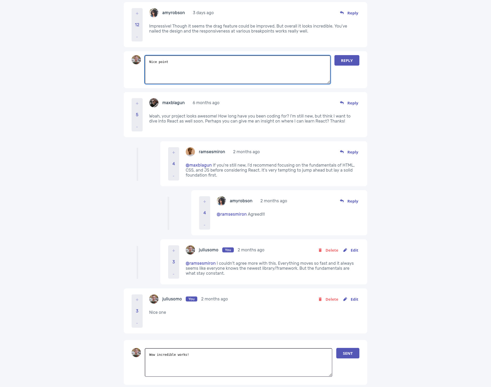
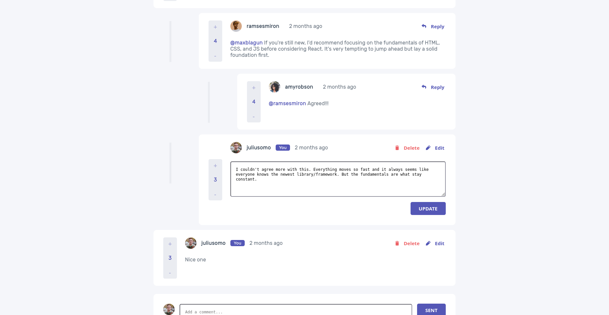
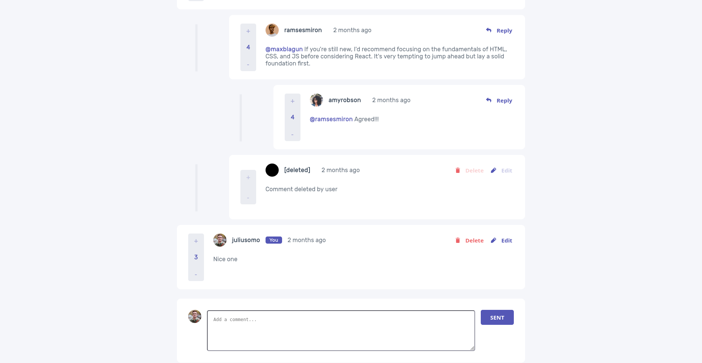

# Frontend Mentor - Interactive comments section solution

This is a solution to the [Interactive comments section challenge on Frontend Mentor](https://www.frontendmentor.io/challenges/interactive-comments-section-iG1RugEG9). Frontend Mentor challenges help you improve your coding skills by building realistic projects.

## Table of contents

- [Overview](#overview)
  - [The challenge](#the-challenge)
  - [Screenshot](#screenshot)
  - [Links](#links)
- [My process](#my-process)
  - [Built with](#built-with)
  - [What I learned](#what-i-learned)
  - [Continued development](#continued-development)
  - [Useful resources](#useful-resources)

## Overview

### The challenge

Users should be able to:

- See hover states for all interactive elements on the page
- Create, Read, Update, and Delete comments and replies
- Upvote and downvote comments
- **Bonus**: If you're building a purely front-end project, use `localStorage` to save the current state in the browser that persists when the browser is refreshed.
- **Bonus**: Instead of using the `createdAt` strings from the `data.json` file, try using timestamps and dynamically track the time since the comment or reply was posted.

### Screenshot






### Links

- Live Site URL: [live Preview](https://azanra.github.io/interactive-comment/)

## My process

### Built with

- Javascript module pattern and constructor
- Datefn library to render date dynamically

### What I learned

Rewrite the whole ui code from scratch after halfway through realizing that my element util try to do whole multiple things at once, and i force my through to make it reusable for all elements which result in a mess pile of code.

```js
export const element = (function () {
  const createDom = (attribute, data) => {
    const parentElement = referenceElement(attribute, data);
    const newElement = document.createElement(attribute.newElement);
    attribute = renderCreatedSince(attribute, data);
    attribute = createImg(attribute, data.user.image.png);
    attribute = populateUniqueText(attribute, data);
    setMultipleAttr(newElement, attribute.elementAttribute);
    setTextContent(newElement, attribute.textContent);
    parentElement.append(newElement);
  };
  /// ....
})();
```

At this point im having difficulties to render some element because changing it, affect the rest of the rendering code, the one that making it difficult is deciding which parent should the new element appended to, is it the one that having unique id or not, and the method at the time really tightly coupled, after a while not touching the project, i need to use debugger because i don't understand what the heck did i just write...

I already use react, and i really like how they handle ui and make the data flow explicit, i decide to use that and create every single rendering component one by one, this more code to write, but it is more flexible and createDom method will only need to create the element without knowing which parrent the element need to be appended to

```js
export const elementUtil = (function () {
  const createDom = (attribute) => {
    const { elementType, elementAttribute, textContent } = attribute;
    const element = document.createElement(elementType);
    setMultipleAttr(element, elementAttribute);
    setTextContent(element, textContent);
    return element;
  };
  // ....
})();
```

and to create element i just need to return the container of those particular component like this

```js
const button = (data = null, attribute, onClick = null, children = null) => {
  const renderButton = () => {
    const btnAttr = elementUtil.setUniqueId(attribute, data);
    const button = elementUtil.createDom(btnAttr);
    onClick && button.addEventListener("click", onClick);
    children && button.appendChild(children);

    return button;
  };

  return renderButton();
};

export default button;

const renderEditBtn = () => {
  const replyBtnContainer = elementUtil.createDom(replyBtnContainerAttr);
  replyBtnContainer.appendChild(button(data, updateBtnAttr, handleEdit));
  return replyBtnContainer;
};
```

Now because of the json data originally nested for each comment that have replies, if it on react it will be pain in the ass to update the state, i try to making it more flat, by having the comment only having the id as child of the replies, and if i need to access the replies. i can use those id with json data, but because of it flat, and i think react docs have some similiar example on how to flattening deeply nested data and rendering it, i try to use those idea

```js
import commentCard from "../component/commentCard";

const renderData = (function () {
  const section = document.querySelector(".section");

  const render = (dataToBeRendered) => {
    const dataToBeRenderedArray = Object.values(dataToBeRendered);
    dataToBeRenderedArray.forEach((data) => {
      if (data.type === "comment") {
        checkData(data, dataToBeRendered);
      }
    });
  };

  const checkData = (dataToCheck, dataToBeRendered) => {
    const replies = dataToCheck.replies;
    const parentComment = commentCard(dataToCheck);
    if (replies.length > 0) {
      replies.map((id) => {
        checkNestedData(id, parentComment, dataToBeRendered);
      });
    }
    section.appendChild(parentComment);
  };

  const checkNestedData = (id, parent, dataToBeRendered) => {
    const data = dataToBeRendered[id];
    const replies = data.replies;
    const repliesComment = commentCard(data);
    parent.appendChild(repliesComment);

    if (replies.length > 0) {
      replies.map((id) => {
        checkNestedData(id, repliesComment, dataToBeRendered);
      });
    }
  };

  return { render };
})();

export default renderData;
```

By looping through each data, and check if those data have replies, it will render those replies, and check it again if those replies have another replies... , i think those are called recursion, where the function call itself if some condition is true to avoid infinite loop

Updating dom manually like this is really painful, and most of the code i spent writing is on the ui side instead of the main logic. i think i will use react for all of the practice project, i think i almost finished almost all of the javascript basic, and i currently on fetch and async and await on odin project, the rest of the js course are computer science stuff and testing.

### Continued development

- Convert it to react

### Useful resources

- [Choosing state structure React](https://react.dev/learn/choosing-the-state-structure) - As a base for flattening and rendering deeply nested data
- [Building reactesque component with vanilla js](https://bluepnume.medium.com/building-a-react-esque-component-using-vanilla-javascript-ddc99e76b867) - As a base on how i render component
